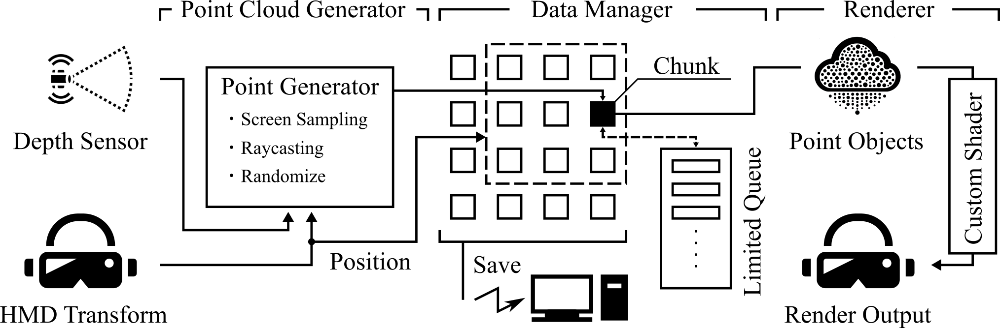

# Depth Scanner - Meta Quest 3 ToF Scanner

## 概要
この Unity プロジェクトは、Meta Quest 3 VR ヘッドセットに搭載されているToFセンサーを利用して環境データをスキャンするアプリケーションです。 
リアルタイムで周囲の環境を取得し、PLY形式の点群データとして出力することができます。 

| Sample  |  |
|---|---|
|   |   |
| リアルタイムで点群を更新 人や手の動きも追跡可能  | 視認補助用グリッド搭載 |
|   |   |
| 上画像と同じ視点の点群データ  | 俯瞰視点の点群データ |

実際に使ってみた動画はこちら -> [https://x.com/Appletea_VRC/status/1847573882238374147](https://x.com/Appletea_VRC/status/1861910477389086953) 
動作環境:Unity 2022.3.43f1 
使用ライブラリ:
 - Meta XR SDK
 - Meta Depth API
 - Meta Building Blocks
 - Mixed-Reality SDK
 - Google.Apis.Drive.v3
 - Better Streaming Assets

加えて、以下のリポジトリを参考にしています。
 - Meta_DepthAPI_Mesh_Generation 
https://github.com/shanerob1106/Meta_DepthAPI_Mesh_Generation
 - Marching-Cubes 
https://github.com/SebLague/Marching-Cubes
 - PointCloudShader 
https://github.com/Kuwamai/PointCloudShader

## 機構解説
 

システム概略図 System Schematic

 - 概要 
  機構を大まかに分けると、
    - Point Cloud Generator
    - Data Manager
    - Renderer 
  の3つに分類できます。
 - Point Cloud Generator 
  旧バージョンではDepthAPIで取得したDepth TextureをScreen Spaceでサンプリングし深度情報を取り出し、Reverse Projection Matrixでサンプリング点に対応した位置座標を取得して点群を計算していましたが、DepthAPIにRaycastメソッドが追加されたことにより、Screen Spaceのサンプリング点から直接位置座標を計算しています。 
  スキャンは非同期処理で、任意インターバルで走査できます。
 - Data Manager 
  取得した点群はグリッド状に一定区間ごとの"Chunk"に振り分けられて保存されます。 
  このデータ構造により、Chunk座標から部分的な点群にアクセスできます。この実装は、Key:Chunk, Value:PointのListのDictionaryで表現しています。 
  Chunkごとに点数上限が設けられており、密度が高くなりすぎることを防止することで点群全体で密度を均一化する働きがあります。この実装は、Limited Queueで表現しています。 
  リアルタイム描画・データ転送におけるメリットとして、描画範囲計算がChunk単位でできるため高速であることと、動的な環境の変化に対して点群の上書きがによって対応できることが挙げられます。 
  描画において、すべてのデータを表示し続けると高負荷であるため、Chunk Loader機構を備えています。 
  Chunk表示数上限、Chunk表示距離制限を適用した点群データをRendererに渡すことで、近接した一定範囲の点群だけを表示できるため低負荷です。この実装は、Chunkの中心座標とHMDの距離による判定と点群数判定で表現しています。 
 - Renderer 
  見やすさと負荷の観点からCustom Shaderを使用しています。 
  具体的には、2次元Gaussianを画面方向に向かせるShaderです。 
  点群のリアルタイム描画では、点をオブジェクトとして配置し、各オブジェクトの見た目をShaderで制御する方式を取っています。 
 - Depth Scanner Shader 
   LiDARからの深度情報を元に周囲環境の形状を視覚化するShaderです。 
   具体的には、Depth Textureから勾配を計算して物体の法線方向を導出、面の位置を推定して視覚的なグリッドを描画しています。

## 利用方法
 - 点群データの保存 
  コントローラの'X'ボタンを押すことで、その時点までにスキャンしていた点群データの保存処理が走ります。PLY形式で保存されます。同時にGoogle Driveの認証用JSONファイルとディレクトリIDがあれば生成した点群データを転送できます。詳しくはこちらをご覧ください。 
  https://techblog.forgevision.com/entry/2023/05/26/120009 
  Press the 'X' button to save point cloud data

## 利用規約
 - MIT Licence

## Special Thanks
制作にご協力いただきありがとうございます。
 - やま 
https://x.com/kw_vrc
 - Meshi 
https://x.com/meshi0217_vrc
