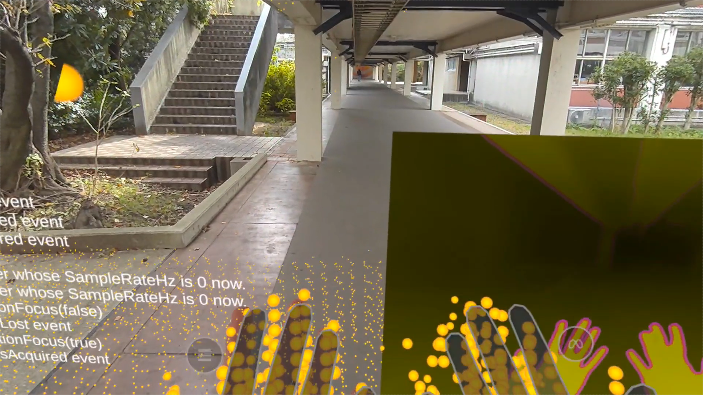
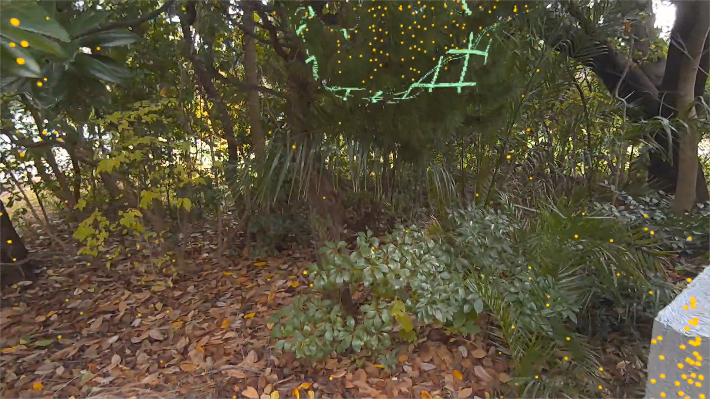
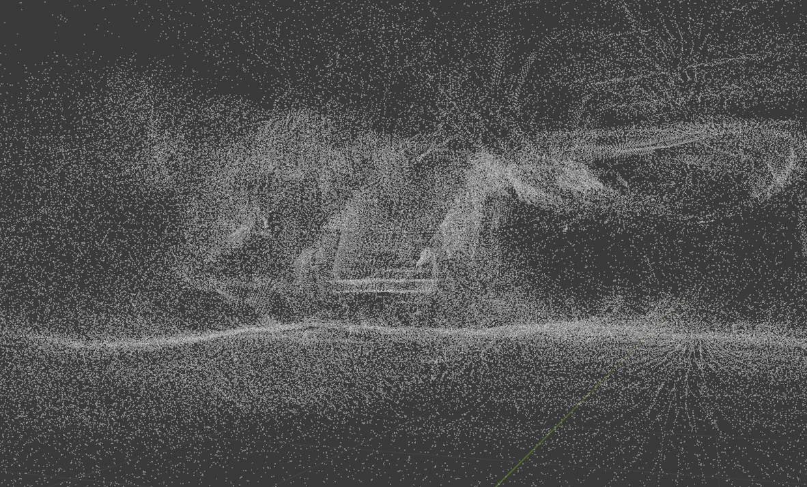
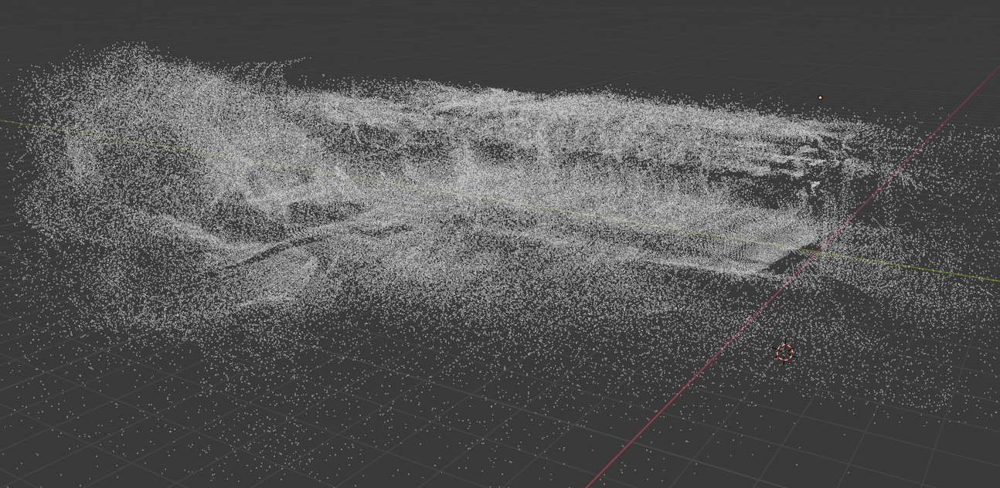

# Depth Scanner - Meta Quest 3 ToF Scanner

## 概要
この Unity プロジェクトは、Meta Quest 3 VR ヘッドセットに搭載されているToFセンサーを利用して環境データをスキャンするアプリケーションです。 
リアルタイムで周囲の環境を取得し、PLY形式の点群データとして出力することができます。 

| Sample  |  |
|---|---|
|   |   |
| リアルタイムで点群を更新 人や手の動きも追跡可能  | 視認補助用グリッド搭載 |
|   |   |
| 上画像と同じ視点の点群データ  | 俯瞰視点の点群データ |

実際に使ってみた動画はこちら -> [https://x.com/Appletea_VRC/status/1847573882238374147](https://x.com/Appletea_VRC/status/1861910477389086953) 
動作環境:Unity 2022.3.43f1 
使用ライブラリ:
 - Meta XR SDK
 - Meta Depth API
 - Meta Building Blocks
 - Mixed-Reality SDK
 - Google.Apis.Drive.v3
 - Better Streaming Assets

加えて、以下のリポジトリを参考にしています。
 - Meta_DepthAPI_Mesh_Generation 
https://github.com/shanerob1106/Meta_DepthAPI_Mesh_Generation
 - Marching-Cubes 
https://github.com/SebLague/Marching-Cubes
 - PointCloudShader 
https://github.com/Kuwamai/PointCloudShader

## 仕様
 - Chunk Loader 
  取得した点群は一定区間ごとの"Chunk"に振り分けられて保存され、描画の軽量化に利用されます。 
  Chunkごとに点数上限が設けられており、密度が高くなりすぎることを防止することで点群全体で密度を均一化する働きがあります。
 - Depth Scanner Shader 
   LiDARからの深度情報を元に周囲環境の形状を視覚化するShaderです。 
   具体的には、Depth Textureから勾配を計算して物体の法線方向を導出、面の位置を推定して視覚的なグリッドを描画しています。

## 利用方法
 - 点群データの保存 
  コントローラの'X'ボタンを押すことで、その時点までにスキャンしていた点群データの保存処理が走ります。PLY形式で保存されます。同時にGoogle Driveの認証用JSONファイルとディレクトリIDがあれば生成した点群データを転送できます。詳しくはこちらをご覧ください。 
  https://techblog.forgevision.com/entry/2023/05/26/120009 
  Press the 'X' button to save point cloud data

## 利用規約
 - MIT Licence

## Special Thanks
制作にご協力いただきありがとうございます。
 - やま 
https://x.com/kw_vrc
 - Meshi 
https://x.com/meshi0217_vrc
